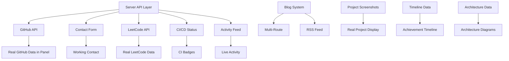

# ROADMAP.md — AyanOS Improvement Roadmap

---

## Priority Definitions

| Priority | Definition | SLA |
|---|---|---|
| **P0 — Critical** | Must fix before any public demo, recruitment use, or competition entry. Directly affects credibility or functionality. | Immediate |
| **P1 — Important** | Significantly improves the project's substance, differentiates from other portfolios, or demonstrates engineering skill. | 1-2 weeks |
| **P2 — Nice to Have** | Polish, accessibility, or features that would be impressive but aren't essential for a strong portfolio. | 1-2 months |

---

## P0 — Critical (Do First)

### 1. Remove All Fake Data & Dead Links

| Attribute | Value |
|---|---|
| **Impact** | 10/10 — Credibility is binary. Fake data destroys trust instantly. |
| **Difficulty** | 1/10 — Deletion + minor UI cleanup |
| **Dependencies** | None |
| **Estimated Effort** | 30 minutes |
| **Business Value** | Removes the #1 reason a recruiter would reject the portfolio |

**Tasks:**
- Remove `Math.sin()` GitHub commit activity chart (`GithubPanel` lines 603-618)
- Remove `Math.sin()` LeetCode heatmap (`LeetcodePanel` lines 439-472)
- Replace hardcoded GitHub stats with "Data loading..." placeholder
- Replace hardcoded LeetCode stats with "Data loading..." placeholder
- Change `ayan.singharoy@example.com` → real email or remove email link
- Change `team-portfolio.example.com` → real demo URL or remove demo link
- Remove `SITE.url` placeholder or mark as `TODO`
- Remove footer note "stats updated manually — sync with the GitHub API for live numbers"

**Expected Reaction:**
- Recruiter: "Finally, honest presentation. I trust this person."
- Judge: "They removed fake data — that's integrity."

---

### 2. GitHub API Integration (Real Data)

| Attribute | Value |
|---|---|
| **Impact** | 10/10 — Replaces the most visible fake data with verifiable proof of activity |
| **Difficulty** | 4/10 — Server route + client fetch + caching |
| **Dependencies** | Server API layer (new), `GITHUB_TOKEN` env var |
| **Estimated Effort** | 3-4 hours |
| **Business Value** | Single highest-impact feature. Proves engineering skill + actual coding activity. |

**Architecture:**
```
src/server/routes/github.ts    (Nitro server route, proxies GitHub API)
src/lib/api-client.ts          (Shared fetch wrapper with caching)
src/components/ayanos/FilePanels.tsx (GithubPanel → fetch from /api/github)
.env                           (GITHUB_TOKEN=ghp_xxxxx)
```

**GitHub API Endpoints to Proxy:**
- `GET /users/ayan-singha-roy` — Profile, repos count, followers
- `GET /users/ayan-singha-roy/repos` — Repository list with languages
- `GET /users/ayan-singha-roy/events/public` — Recent activity (contributions)
- Optional: GraphQL for contribution calendar (heatmap data)

**Caching:** 1 hour (contributions change slowly)

**Expected Reaction:**
- Recruiter: Clicks GitHub link → sees same numbers → "This is real."
- Judge: "They built a server-side API proxy with caching — that's backend engineering."

---

### 3. Contact Form Backend (Real Submission)

| Attribute | Value |
|---|---|
| **Impact** | 9/10 — The only conversion path for recruiters. Currently broken without Formspree. |
| **Difficulty** | 3/10 — Server route + email service |
| **Dependencies** | Server API layer, email service (Resend, SendGrid, or Formspree) |
| **Estimated Effort** | 2 hours |
| **Business Value** | Recruiters must be able to contact you. Period. |

**Architecture:**
```
src/server/routes/contact.ts   (Nitro server route)
src/components/ayanos/FilePanels.tsx (ContactPanel → POST to /api/contact)
.env                           (RESEND_API_KEY or similar)
```

**Implementation Options:**
- **Option A:** Server route → Resend API (recommended, free tier)
- **Option B:** Keep Formspree but make it mandatory (document in README)
- **Option C:** Supabase Edge Functions + Resend (if Supabase already used)

**Must fix:**
- Email in `ayanos-data.ts` must be real
- Form shows "message sent" only on actual success
- Error handling for rate limits, invalid email, network failure

---

### 4. Resume PDF Generation

| Attribute | Value |
|---|---|
| **Impact** | 9/10 — Every recruiter expects a downloadable PDF |
| **Difficulty** | 5/10 — PDF generation library + data mapping |
| **Dependencies** | PDF library (jsPDF, @react-pdf/renderer, or server-side Puppeteer) |
| **Estimated Effort** | 3-4 hours |
| **Business Value** | Professional expectation. "Save as PDF" workaround is not acceptable. |

**Options:**
- **Client-side:** `@react-pdf/renderer` (React components → PDF) — stays in React ecosystem
- **Server-side:** Puppeteer in Nitro server route (renders HTML → PDF) — more reliable
- **Hybrid:** Generate from same data source used by ResumePanel

**Required:**
- Download button that triggers actual file download
- Filename: `Ayan_Singha_Roy_Resume.pdf`
- Clean PDF layout (no browser print margins)

---

## P1 — Important (Do Next)

### 5. LeetCode API Integration

| Attribute | Value |
|---|---|
| **Impact** | 8/10 — Verifiable competitive programming skill |
| **Difficulty** | 6/10 — No official API; requires scraping or third-party |
| **Dependencies** | Server route, LeetCode session cookie or third-party API |
| **Estimated Effort** | 4-6 hours |
| **Business Value** | High for software engineering roles. Differentiates from non-competitive candidates. |

**Approaches:**
- **LeetCode GraphQL API** (undocumented, requires session cookie)
- **Third-party:** leetcode-api.vercel.app, leetcode-stats-api
- **Self-hosted scraper:** Puppeteer + scheduled job to update JSON

**Recommended:** Third-party API + server-side caching (6 hours) + graceful fallback

---

### 6. Blog / Technical Articles System

| Attribute | Value |
|---|---|
| **Impact** | 8/10 — Demonstrates communication, depth, and teaching ability |
| **Difficulty** | 6/10 — MDX rendering, new routes, content management |
| **Dependencies** | TanStack Start multi-route support, MDX plugin, content files |
| **Estimated Effort** | 6-8 hours |
| **Business Value** | Engineers who write get better offers. Content marketing for yourself. |

**Architecture:**
```
content/blog/
  ├─ 2026-01-15-building-ayanos.mdx
  ├─ 2026-02-20-leetcode-patterns.mdx
  └─ ...

src/server/routes/blog/[slug].ts    (Server route: read .mdx, return JSON)
src/routes/blog/[slug].tsx          (Page route: render article)
src/routes/blog/index.tsx           (Blog index page)
```

**Features:**
- Frontmatter: title, date, tags, description
- Code syntax highlighting
- Reading time estimate
- Share links

---

### 7. Project Architecture Visualizations

| Attribute | Value |
|---|---|
| **Impact** | 8/10 — Shows systems thinking, not just feature lists |
| **Difficulty** | 7/10 — Diagram library (Mermaid, D3, or Recharts) + custom data |
| **Dependencies** | Diagram library, project metadata extension |
| **Estimated Effort** | 5-6 hours |
| **Business Value** | Impresses senior engineers and architects. "This person thinks in systems." |

**Data Extension:**
```typescript
// In ayanos-data.ts
export type ProjectArchitecture = {
  components: Component[];
  dataFlow: string;  // Mermaid diagram
  infrastructure: string;
  decisions: Decision[];
};
```

**Display:** Interactive Mermaid diagrams in ProjectDetail panel

---

### 8. CI/CD Pipeline Status Display

| Attribute | Value |
|---|---|
| **Impact** | 7/10 — Demonstrates DevOps maturity |
| **Difficulty** | 5/10 — GitHub Actions API + server route |
| **Dependencies** | Server route, `GITHUB_TOKEN` (already needed) |
| **Estimated Effort** | 3-4 hours |
| **Business Value** | Shows you understand the full development lifecycle |

**Architecture:**
```
src/server/routes/ci-status.ts   (Fetch from GitHub Actions API)
GithubPanel → new "CI/CD" section with workflow badges
```

**Display:** Workflow status badges (passing/failing) per repo

---

### 9. Visitor Analytics Dashboard

| Attribute | Value |
|---|---|
| **Impact** | 7/10 — Shows data-driven mindset |
| **Difficulty** | 5/10 — Server KV store or third-party |
| **Dependencies** | Analytics storage (Cloudflare KV, Supabase, or self-hosted) |
| **Estimated Effort** | 3-4 hours |
| **Business Value** | Proves you measure impact, not just build features |

**Implementation:**
- **Simple:** Cloudflare KV counter (page views + unique IPs)
- **Advanced:** Plausible / Umami / PostHog (privacy-friendly)
- **Display:** Analytics panel in OS (visible to visitors or private)

---

### 10. Live Coding Activity Feed

| Attribute | Value |
|---|---|
| **Impact** | 7/10 — Proves ongoing activity, not a static portfolio |
| **Difficulty** | 5/10 — GitHub Events API + polling/SSE |
| **Dependencies** | `GITHUB_TOKEN`, server route |
| **Estimated Effort** | 3-4 hours |
| **Business Value** | Recruiters see you're *currently* coding, not just *have coded* |

**Architecture:**
```
src/server/routes/activity.ts    (Fetch recent GitHub events)
Terminal command: "activity" → shows recent commits/PRs/issues
Sidebar: "Recent Activity" widget
```

---

### 11. Achievement Timeline

| Attribute | Value |
|---|---|
| **Impact** | 7/10 — Narrative arc shows growth trajectory |
| **Difficulty** | 3/10 — Data modeling + UI component |
| **Dependencies** | Extended data in `ayanos-data.ts` |
| **Estimated Effort** | 2-3 hours |
| **Business Value** | Tells the story of *becoming* an engineer, not just being one |

**Data Model:**
```typescript
export const TIMELINE = [
  { date: "2024-06", event: "Started B.Tech CSE", type: "education" },
  { date: "2024-12", event: "First GitHub commit", type: "code" },
  { date: "2025-03", event: "50 LeetCode problems solved", type: "achievement" },
  { date: "2025-08", event: "Built DownTube", type: "project" },
  // ...
];
```

**Display:** Vertical timeline panel (new file in explorer)

---

### 12. Project Detail Pages with Real Screenshots

| Attribute | Value |
|---|---|
| **Impact** | 7/10 — Evidence over claims |
| **Difficulty** | 4/10 — Image assets + updated data |
| **Dependencies** | Real project screenshots (take them!) |
| **Estimated Effort** | 2-3 hours (+ screenshot time) |
| **Business Value** | Visual proof of work. Recruiters skim — screenshots catch attention. |

**Tasks:**
- Take screenshots of all 3 current projects
- Add `screenshot` field to project data
- Display in ProjectDetail panel (replace gradient placeholder)
- Add live demo links that actually work

---

## P2 — Nice to Have

### 13. AI/ML Experiment Dashboard

| Attribute | Value |
|---|---|
| **Impact** | 8/10 for AI/ML roles — Niche but high-signal |
| **Difficulty** | 8/10 — ML experiment tracking integration |
| **Dependencies** | MLflow, Weights & Biases, or custom tracking |
| **Estimated Effort** | 8-10 hours |
| **Business Value** | Differentiates for AI/ML focused roles |

---

### 14. Cybersecurity Lab Showcase

| Attribute | Value |
|---|---|
| **Impact** | 7/10 for security roles |
| **Difficulty** | 7/10 — CTF writeups + tool demos |
| **Dependencies** | Content creation (writeups) |
| **Estimated Effort** | 6-8 hours |
| **Business Value** | Practical security skills are rare in student portfolios |

---

### 15. Interactive Code Playground

| Attribute | Value |
|---|---|
| **Impact** | 7/10 — Highest engagement feature |
| **Difficulty** | 8/10 — In-browser execution (WebContainer, StackBlitz, or custom) |
| **Dependencies** | WebContainer API or similar |
| **Estimated Effort** | 10+ hours |
| **Business Value** | Judges/recruiters can *run* your code. Memorable. |

---

### 16. Multi-Route Support (Blog Pages)

| Attribute | Value |
|---|---|
| **Impact** | 6/10 — Better SEO, shareable links |
| **Difficulty** | 3/10 — TanStack Start already supports it |
| **Dependencies** | Blog system (item 6) |
| **Estimated Effort** | 2 hours |
| **Business Value** | Professional information architecture |

---

### 17. Dark/Light Theme Toggle

| Attribute | Value |
|---|---|
| **Impact** | 5/10 — Accessibility and preference |
| **Difficulty** | 2/10 — CSS variables + toggle + localStorage |
| **Dependencies** | None |
| **Estimated Effort** | 1-2 hours |
| **Business Value** | Minor positive signal |

---

### 18. Performance Monitoring

| Attribute | Value |
|---|---|
| **Impact** | 6/10 — Shows engineering rigor |
| **Difficulty** | 5/10 — Web Vitals API + display |
| **Dependencies** | Analytics or custom |
| **Estimated Effort** | 3-4 hours |
| **Business Value** | "They understand Core Web Vitals" |

---

### 19. End-to-End Test Suite

| Attribute | Value |
|---|---|
| **Impact** | 5/10 — Demonstrates testing discipline |
| **Difficulty** | 5/10 — Playwright setup + CI |
| **Dependencies** | CI/CD pipeline |
| **Estimated Effort** | 4-6 hours |
| **Business Value** | "They test their code" — rare in student projects |

---

### 20. RSS Feed

| Attribute | Value |
|---|---|
| **Impact** | 3/10 — Low effort, useful for blog |
| **Difficulty** | 1/10 — XML generation |
| **Dependencies** | Blog system |
| **Estimated Effort** | 30 minutes |
| **Business Value** | Negligible but easy |

---

## Implementation Order (Critical Path)

```
Week 1:
  1. Remove fake data (30 min)
  2. GitHub API integration (3-4 hrs)
  3. Contact form backend (2 hrs)
  4. Resume PDF (3-4 hrs)

Week 2:
  5. LeetCode API (4-6 hrs)
  6. Blog system (6-8 hrs)

Week 3-4:
  7. Architecture visualizations (5-6 hrs)
  8. CI/CD status (3-4 hrs)
  9. Analytics (3-4 hrs)
  10. Activity feed (3-4 hrs)
  11. Achievement timeline (2-3 hrs)
  12. Project screenshots (2-3 hrs)

Month 2+:
  P2 items as time permits
```

---

## Dependency Graph



---

*Last updated: 2026-09-15*